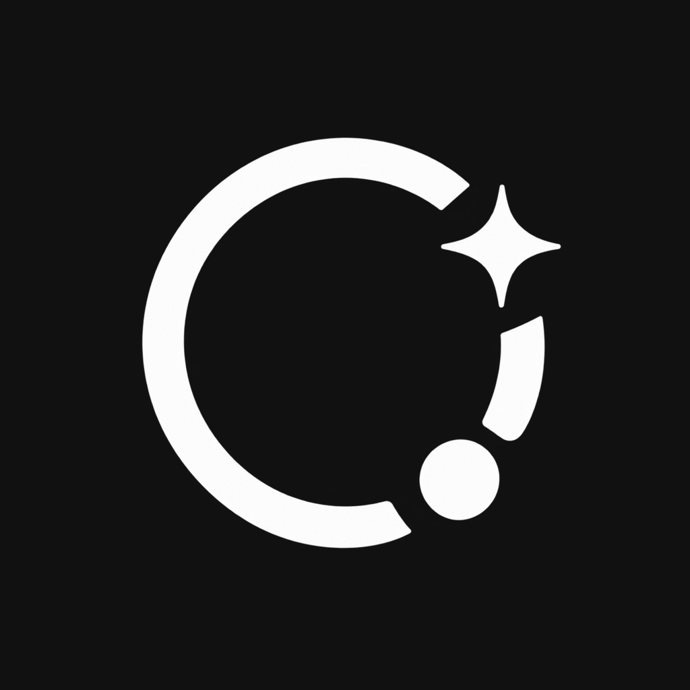

<div align="center">
  
  <h1>IDK Nova</h1>
  <p><strong>Your private, configurable AI workspace for Windows, macOS, and the web.</strong></p>
  <p>Connect local Ollama or LM Studio models, company AI servers, and OpenAI-compatible cloud providers from one clean desktop experience.</p>

  [](https://github.com/r-winn/IDK-Nova/releases/latest)
  [](https://github.com/r-winn/IDK-Nova/releases/latest/download/IDK.Nova_0.15.0_x64-setup.exe)
  [](https://github.com/r-winn/IDK-Nova/releases/latest/download/IDK.Nova_0.15.0_universal.dmg)
  [](https://r-winn.github.io/IDK-Nova/)
  [](LICENSE)
</div>

> IDK Nova is an early open-source release. Verify important AI responses and only send sensitive information to providers you trust.

<p align="center"></p>

## Get Nova

| Platform | Recommended download | Alternative |
| --- | --- | --- |
| Windows 10/11 (64-bit) | **[Download Setup.exe](https://github.com/r-winn/IDK-Nova/releases/latest/download/IDK.Nova_0.15.0_x64-setup.exe)** | [MSI for managed deployment](https://github.com/r-winn/IDK-Nova/releases/latest/download/IDK.Nova_0.15.0_x64_en-US.msi) |
| macOS (Apple Silicon + Intel) | **[Download Universal DMG](https://github.com/r-winn/IDK-Nova/releases/latest/download/IDK.Nova_0.15.0_universal.dmg)** | — |
| Browser | **[Open the web app](https://r-winn.github.io/IDK-Nova/)** | Desktop is required for Nova Work and local GGUF import |

All official binaries are attached to the **[latest GitHub Release](https://github.com/r-winn/IDK-Nova/releases/latest)**. Do not download Nova installers from unofficial mirrors.

## Download and use on Windows

### Install on Windows

Go to **[Latest Release](https://github.com/r-winn/IDK-Nova/releases/latest)** and download one of these files:

| File | Recommended for | How it works |
| --- | --- | --- |
| `IDK.Nova_*_x64-setup.exe` | Most Windows users | Opens a standard installation wizard. Click **Next**, **Install**, then **Finish**. |
| `IDK.Nova_*_x64_en-US.msi` | IT administrators and managed deployment | Windows Installer package suitable for organizational deployment tools. |

Nova currently targets 64-bit Windows 10 and Windows 11. Windows may show a SmartScreen notice because community builds are not yet code-signed. Confirm that the publisher file came from this repository's official Releases page before continuing.

If Microsoft Defender SmartScreen appears, first confirm that the file name and download source match the official release. Then choose **More info → Run anyway**. Never bypass this warning for a copy obtained from another website.

The release pipeline is ready for Authenticode signing. Maintainers can follow
[WINDOWS_SIGNING.md](WINDOWS_SIGNING.md) to add an encrypted certificate to
GitHub Actions without committing private signing material.

### Install on macOS

Go to **[Latest Release](https://github.com/r-winn/IDK-Nova/releases/latest)** and download the universal `.dmg` file. It contains both Apple Silicon and Intel code, so the same download works on modern M-series MacBooks and older Intel Macs.

1. Open `IDK.Nova_*_universal.dmg` from Downloads.
2. Drag **IDK Nova** into **Applications**. Run the copy in Applications—not the copy inside the DMG.
3. Try to open Nova once. If macOS blocks it, dismiss the warning without moving the app to Trash.
4. Open **Apple menu → System Settings → Privacy & Security**.
5. Scroll to **Security**. Find the message that IDK Nova was blocked and choose **Open Anyway**.
6. Authenticate with Touch ID or your Mac password, then choose **Open** in the final confirmation.

On some macOS versions you can instead Control-click **IDK Nova** in Applications, choose **Open**, and confirm **Open**. The approval is normally needed only for the first launch of a community build.

The macOS build includes Nova Work, local folder access, the native Workspace browser, provider connections, and the same in-app updater used by Windows. The current community DMG has an ad-hoc signature. A paid Apple Developer ID certificate and notarization are still required to remove the first-launch Gatekeeper approval for public distribution.

### Start an AI provider

Nova is the interface; the model runs through a provider. The easiest private option is [Ollama](https://ollama.com/).

You can install Ollama yourself, or import a `.gguf` file in Nova and use **Download & install Ollama**. Nova downloads the official GitHub release for the current operating system, verifies it, and shows byte-level progress on Windows and macOS. To download a lightweight model manually:

```powershell
ollama pull qwen2.5:0.5b
```

Ollama normally starts its local server automatically. Keep it running while using Nova.

### Connect Nova to the model

1. Open **IDK Nova**.
2. Open **Settings → Models**.
3. Choose **Add new model → Connect an API**.
4. Enter `http://localhost:11434/v1` as the **Base URL**.
5. Leave **API key** empty for local Ollama.
6. Leave the Model ID empty to discover models, or enter `qwen2.5:0.5b`.
7. Choose **Test & add model** and wait for verification.
8. Choose **Save changes** and start a new chat.

Nova only lists models returned by the real provider endpoint or model IDs you explicitly add. Manually entered models must answer a test completion before Nova accepts them.

Alternatively, the desktop app can import a local `.gguf` file from **Settings → Models → Add new model → Import a local file**. Nova keeps a private copy in its application-data folder and registers it with Ollama automatically, so no endpoint or model ID is required.

## Use the web version

Open **[IDK Nova Web](https://r-winn.github.io/IDK-Nova/)**. The web app has the same provider settings and updates automatically after each published release.

Local browser connections use:

| Provider | Base URL |
| --- | --- |
| Ollama | `http://127.0.0.1:11434/v1` |
| LM Studio | `http://localhost:1234/v1` |
| OpenAI-compatible server | The `/v1` URL supplied by your administrator |

Your browser or provider must allow requests from the Nova website. The Windows desktop app is recommended when a local server blocks browser access.

## What Nova includes

- **Nova Work (desktop):** attach a real project folder, keep project chats separate, index files locally, and give the selected AI request-aware context from relevant text and source files
- Three enforced Work approval levels with inline Yes/No prompts and live agent progress
- Streaming AI conversations with searchable local history
- Multiple providers and separate real model lists
- Desktop GGUF import with private local storage and automatic Ollama registration
- Connection discovery, completion tests, verification status, and latency
- Text, image, PDF, Markdown, JSON, and CSV attachments
- Voice input where the operating system supports it
- Local Ollama and LM Studio support
- OpenAI-compatible company and cloud endpoints
- Optional database and long-term-memory configuration
- Automatic system theme plus manual light and dark appearance
- Configurable application name, workspace name, accent color, and logo
- Managed JSON configuration for organizational distribution
- Signed in-app desktop updates with download progress and restart-to-install

Image analysis requires a vision-capable model. A text-only model such as `qwen2.5:0.5b` can chat and help with code but cannot understand an uploaded image.

## Nova Work: local project intelligence

Nova Work is available in the desktop application because a normal website cannot safely retain broad access to arbitrary folders on your computer.

1. Open **Work** in the sidebar and choose **Add workspace**.
2. Select one project folder using the native system picker.
3. Start a **New work chat** inside that workspace.
4. Ask about the project, a feature, or an error. Nova builds a local file index and includes only relevant supported text files in that request.

Nova can read supported project files, search the web in Workspace Browser, create or update project files, observe the primary display, open installed applications, click, type, press shortcuts, and scroll on Windows and macOS. Desktop control requires a provider that supports both tool calling and vision. **Ask for approval** confirms every browser, screen, app, input, and file-changing action. **Approve for me** allows observation and research automatically but confirms clicks, typing, app launches, and file changes. **Full access** can continue automatically until you press Stop.

Desktop access remains visible and interruptible. Nova blocks credential entry, purchases, authentication, sending or submitting forms, security-setting changes, deletion, and other irreversible operations. Project-file tools also block secret files, dependency/build folders, symbolic links, binary files, oversized files, and every path outside the selected project. Choose a provider you trust before discussing private code or sharing your screen.

### Desktop-control permissions

- **macOS:** open **System Settings → Privacy & Security**, enable **Accessibility** and **Screen Recording** for IDK Nova, then fully quit and reopen the app.
- **Windows:** approve any system permission prompt that appears. Nova controls only the active user desktop and does not install a background service.
- Start with **Ask for approval** while testing a new model. Use **Full access** only for a model and task you trust, and keep the Stop control visible.

Nova creates a hidden `.nova-work` directory inside a folder after you explicitly attach it. It contains portable project identity, Work chat history, and a compact activity record. Copying the complete project folder to another computer and attaching it there restores that Work history. This is portable local state—not an undisclosed cloud sync service—and can be excluded from version control if you do not want chat history committed to a repository.

## Settings guide

| Section | Purpose |
| --- | --- |
| **General** | Change the product name, workspace name, logo, accent, and response creativity. |
| **Models** | Add providers, discover installed models, test connections, and select the active model. |
| **Data & memory** | Configure PostgreSQL, MySQL, SQLite, or an HTTP data service for future memory integrations. |
| **Updates** | Check, securely download, and install signed releases without leaving the desktop app. |
| **About** | View the installed version, configuration mode, and license. |

## Organizational and white-label deployment

Nova can be prepared for a company, team, or client before distribution.

1. Copy [`public/idk-nova.config.example.json`](public/idk-nova.config.example.json).
2. Rename the copy to `idk-nova.config.json`.
3. Set the application name, workspace name, accent, approved providers, and model IDs.
4. Add a transparent PNG, SVG, or WebP logo as a data URL, or import the configuration through **Settings → Import config**.
5. Build and distribute the resulting Windows installer.

Users can also configure one installation and choose **Export config** to create a reusable file for other installations. API keys and database credentials are intentionally removed from exported files.

Example:

```json
{
  "branding": {
    "appName": "Acme AI",
    "workspaceName": "Acme Private Workspace",
    "accent": "#0f766e",
    "logoDataUrl": ""
  },
  "providers": [
    {
      "id": "company-ai",
      "name": "Company AI",
      "baseUrl": "https://ai.example.com/v1",
      "apiKey": "",
      "models": ["company-chat"]
    }
  ],
  "activeProviderId": "company-ai",
  "activeModel": "company-chat"
}
```

Do not commit real API keys or database passwords. Supply secrets separately on each device.

## Troubleshooting

### Nova cannot discover any models

- Confirm Ollama or LM Studio is running.
- Open `http://127.0.0.1:11434/v1/models` for Ollama and check that it returns JSON.
- Confirm the Base URL ends in `/v1`.
- Run `ollama list` and verify that at least one model is installed.

### Model test fails

- Confirm the exact model ID matches the provider's model list.
- Verify the API key for cloud or company providers.
- Check whether a firewall, proxy, VPN, or browser CORS policy blocks the request.
- Try the Windows desktop app to distinguish a browser restriction from a provider problem.

### The model replies poorly or cannot read images

Model quality is independent of Nova. Very small models are fast but limited. Install a larger instruction model for better reasoning, or a vision model for image understanding.

## Run from source

Requirements: Node.js 22 or newer and npm.

```bash
git clone https://github.com/r-winn/IDK-Nova.git
cd IDK-Nova
npm install
npm run dev
```

Open `http://localhost:1430`.

Production web build:

```bash
npm run build
npm run preview
```

Desktop builds require Rust and the platform-specific [Tauri prerequisites](https://v2.tauri.app/start/prerequisites/):

```bash
npm run desktop:build
```

## Updates and releases

[`public/version.json`](public/version.json) is the web release manifest. Windows and macOS use Tauri's signed multi-platform updater manifest (`latest.json`) generated by GitHub Actions. The website is deployed from `main`; desktop releases are built on real Windows and macOS GitHub runners whenever a `v*` tag is pushed. Update the package version, Tauri version, web manifest, and Git tag together.

## Security

- Local provider requests stay between Nova and the configured local endpoint.
- Cloud requests go directly to the provider you configure.
- Provider credentials are stored only in the local browser profile or desktop WebView profile and are never uploaded by Nova itself.
- Exported managed configurations exclude API keys and database URLs.
- AI output and uploaded content should be treated as untrusted in code or automated workflows.

Please read [SECURITY.md](SECURITY.md) before production or organizational deployment. Report vulnerabilities privately through the process described there.

## Contributing

Contributions are welcome. Read [CONTRIBUTING.md](CONTRIBUTING.md), open an issue with reproducible details, and keep pull requests focused. The project is released under the [MIT License](LICENSE).
